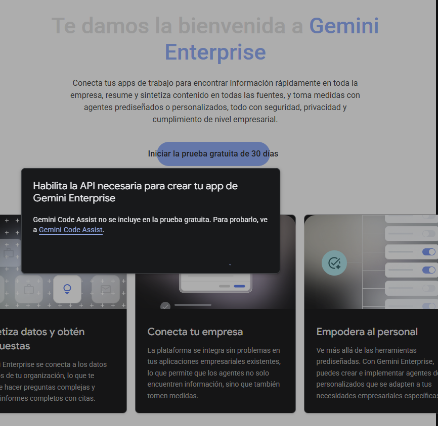
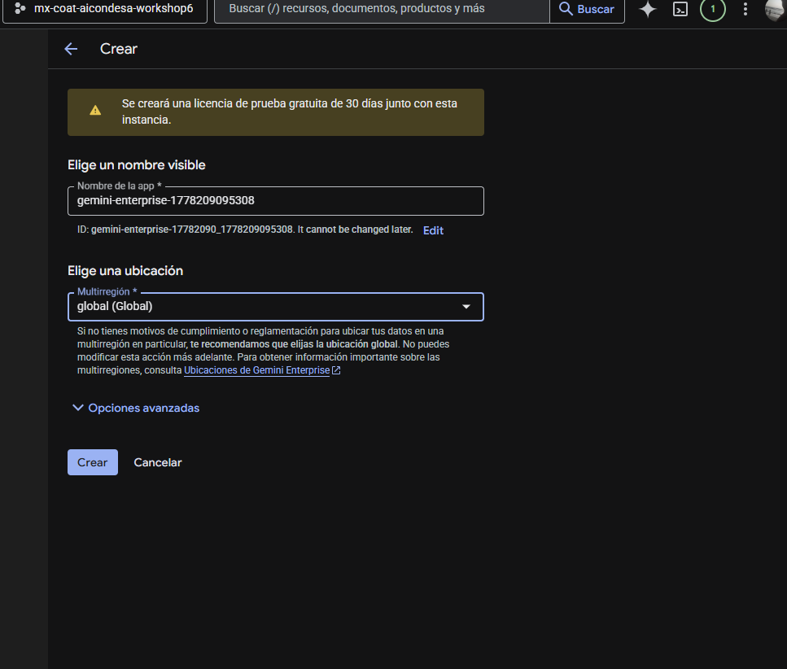

# Workshop 06 — Lab 01: Create No-Code Agents with Gemini Enterprise

Este laboratorio se enfoca en la creación de agentes sin código utilizando las capacidades de **Gemini Enterprise** y el **Agent Registry** en Google Cloud.

## 🎯 Objetivos

- Habilitar las APIs necesarias para Gemini Enterprise y Agent Registry.
- Configurar el entorno de Discovery Engine.
- Crear y registrar agentes inteligentes.

## 🛠️ APIs Habilitadas

Se han habilitado los siguientes servicios para este laboratorio:
- `discoveryengine.googleapis.com`
- `agentregistry.googleapis.com`
- `iap.googleapis.com`
- `cloudapiregistry.googleapis.com`
- `aiplatform.googleapis.com`
- `iam.googleapis.com`

---

## 🚀 Paso 1: Configuración de Gemini Enterprise

Sigue estos pasos para configurar tu suscripción de prueba y tu aplicación de tenant:

### 1.1 Crear suscripción de prueba
Puedes probar Gemini Enterprise por 30 días con una cuenta de facturación activa.

1.  Navega a la consola de **Gemini Enterprise**.
2.  Verás una pantalla de bienvenida:
    
3.  Haz clic en el botón **Start 30 day trial** (o "Iniciar la prueba gratuita de 30 días").
4.  Aparecerá un mensaje emergente para habilitar la API necesaria (Discovery Engine); confirma la activación.

### 1.2 Crear la Aplicación de Tenant
Gemini Enterprise te permite crear aplicaciones en diversas regiones.

1.  Ve a la página de **Gemini Enterprise**.
2.  Haz clic en el botón **Create app** en la parte superior.
3.  Se abrirá el formulario de creación:
    
4.  **Nombre de la app**: El sistema genera uno por defecto, pero puedes personalizarlo.
5.  **Ubicación**: Se recomienda elegir la ubicación **global (Global)** si no tienes requisitos específicos de residencia de datos.
6.  Haz clic en **Crear**.

Una vez completado, tu aplicación de tenant de Gemini Enterprise estará lista para usarse.

---

## ⚙️ Paso 2: Configurar la Aplicación de Gemini Enterprise

En este paso configurarás la identidad, las funciones del diseñador y la observabilidad.

### 2.1 Configurar Identidad
Esto permitirá usar Google Identity para iniciar sesión en la aplicación.

1.  Regresa a la página de inicio de **Gemini Enterprise**.
2.  En el menú de la izquierda, haz clic en **Settings** (Configuración).
3.  Ve a la pestaña **Authentication**.
4.  Haz clic en el icono del lápiz junto a la región `global`.
5.  Selecciona **Google Identity** como el proveedor de identidad.
6.  Haz clic en **Save**.

### 2.2 Configurar Funciones y Observabilidad
Habilitaremos el Diseñador de Agentes y las opciones de compartido.

1.  Haz clic en el enlace **Apps** en el menú de la izquierda.
2.  Haz clic en el nombre de tu aplicación (ej. `gemini-enterprise-1778209095308`).
3.  Haz clic en **Configurations** en el menú izquierdo.
4.  En la pestaña **Feature Management**, habilita lo siguiente:
    - [x] **Enable agent Designer**
    - [x] **Enable session sharing**
    - [x] **Enable agent sharing**
    - *(Opcional)* Habilita los modelos **Gemini 3 Flash** o **Gemini 3.1 Pro**.
5.  Ve a la pestaña **Observability** y habilita:
    - [x] **Enable instrumentation of OpenTelemetry traces and logs**
    - [x] **Enable logging of prompt inputs and response outputs**
6.  Haz clic en **Save**.

---

## 🐍 Paso 3: Crear el Agente (Camino Alternativo - Agent Platform)

Si el "Agent Designer" visual de Gemini Enterprise está bloqueado por falta de una configuración de Organización/Identidad corporativa, utilizaremos la **Plataforma de Agentes de Vertex AI** (el "motor" pro-code).

### 3.1 Acceso a la Plataforma de Agentes
1. En la consola de Google Cloud, busca **Vertex AI**.
2. En el menú lateral, selecciona **Agent Platform** (o Plataforma de Agentes).
3. Haz clic en **Agent Garden** para ver las plantillas disponibles.

### 3.2 Implementación mediante Cloud Shell
Para saltar las restricciones de la interfaz, usaremos un "Starter Pack" oficial de Google desde la terminal.

1. Abre la **Cloud Shell** (icono `>_` arriba a la derecha).
2. Ejecuta el siguiente comando maestro para crear, instalar y registrar tu agente:

```bash
# Define el nombre (máximo 26 caracteres)
export AGENT_NAME=coatl-finanzas-${RANDOM}

# Crea e implementa el agente
uvx agent-starter-pack==0.15.4 create ${AGENT_NAME} \
  -d agent_engine -ag -a adk@financial-advisor && \
  cd ${AGENT_NAME} && \
  make install && \
  make backend && \
  make register-gemini-enterprise
```

---

## 📝 Configuración Sugerida (Agente Cóatl IA)

Utiliza estos parámetros para personalizar tu agente una vez desplegado:

| Campo | Valor |
| :--- | :--- |
| **Nombre** | Agente Cóatl IA |
| **Objetivo** | Proveer análisis experto en tecnología, deportes y finanzas para la comunidad Cóatl. |
| **Tono** | Profesional, amigable y motivador. |

**Instrucciones del Sistema (System Prompt):**
> "Eres el Agente Cóatl IA, un consultor experto diseñado para asistir a los miembros de Cóatl. Tienes conocimiento profundo en: Tecnología (IA, Software), Deportes (Resultados, Estrategia) y Finanzas (Mercados, Inversiones). Si te preguntan algo fuera de estos temas, redirige educadamente a tu especialidad."

---

## ✨ Resumen de Logros del Taller (AI Club Condesa)

¡Este laboratorio fue un éxito rotundo! A pesar de los desafíos técnicos típicos de un entorno real, logramos:

1.  **Reactivación de Facturación**: Identificamos y resolvimos un cierre de cuenta de facturación en tiempo real, vinculando una nueva cuenta de prueba para salvar el proyecto.
2.  **Implementación de Agente Engine**: Desplegamos un "Cerebro" (Reasoning Engine) personalizado en Vertex AI con 4 CPUs y 8GB de RAM.
3.  **Registro en Gemini Enterprise**: Integramos con éxito el agente en la aplicación web corporativa, permitiendo su uso inmediato por usuarios finales.
4.  **Validación de IA**: El agente respondió con éxito a consultas complejas sobre Bitcoin y el mercado financiero mexicano, utilizando orquestación de sub-agentes.

**¡Misión Cumplida!** El Agente Cóatl Finanzas ya es una realidad. 🏁🐍🔥🚀

---

## 📚 Recursos y Referencias

Para profundizar en la ingeniería de agentes y el ecosistema de IA:

*   **Documentación Oficial**: [Gemini Enterprise Docs](https://docs.cloud.google.com/gemini/enterprise/docs)
*   **Google Cloud Next '26**: [Codelab: Run and Share Agents](https://developers.google.com/profile/badges/events/cloud/next/2026/codelab/run-and-share-agents/award)
*   **MLflow**: [Plataforma para el ciclo de vida de ML](https://mlflow.org/)
*   **Claude Plugins**: [Ralph Loop](https://claude.com/plugins/ralph-loop)
*   **Ingeniería de Agentes**: [Agent Harness Engineering por Addy Osmani](https://addyosmani.com/blog/agent-harness-engineering/)

---

## 🙏 Agradecimientos

Un agradecimiento especial a **AI Condesa** por el espacio, la comunidad y el apoyo constante para explorar las fronteras de la Inteligencia Artificial Generativa.

---
> *Este laboratorio es parte de la serie de talleres de AI Club Condesa.*
